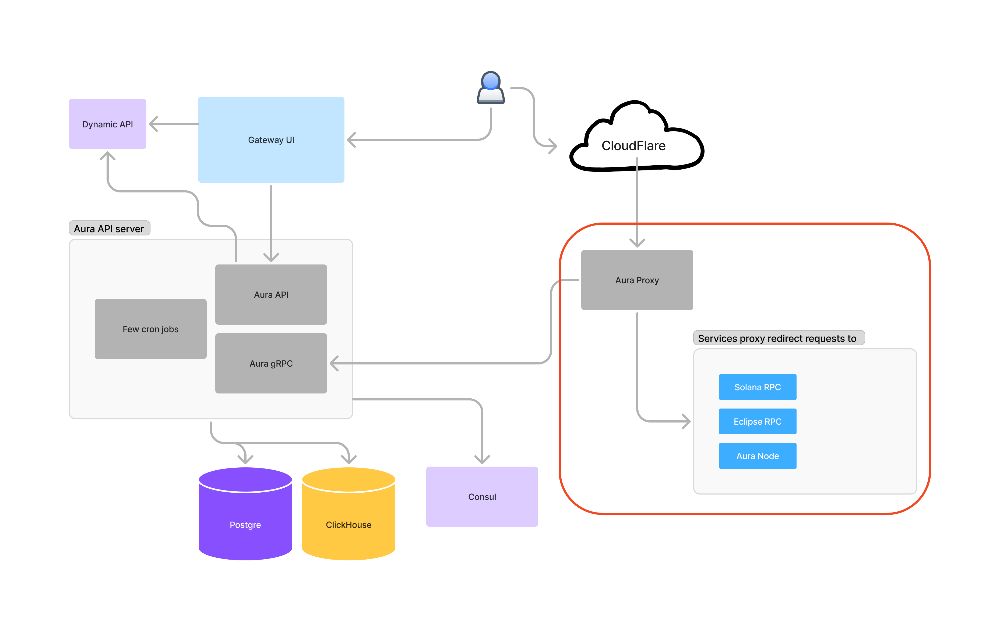

# Aura proxy

The Aura Proxy serves as an intermediary between users and processing providers.

This diagram illustrates the complete project architecture, with the red oval highlighting the functionality contained in this repository.



## Overview

Aura Proxy functions as a request router that:

- Receives requests from users
- Redirects them to appropriate processing providers
- Manages request statistics and user data

The proxy communicates with the Aura API via gRPC to:

- Retrieve user information and subscription plans
- Store request statistics

All request statistics are initially cached locally on the proxy side before being periodically flushed and transmitted via gRPC to ClickHouse for permanent storage.

# How to launch

Aura Proxy requires the Aura API to be running before it can function properly.

Then `.env` file should be created. There is example config in `.env.example`.

Command to launch project without docker:

```
go run cmd/proxy/proxy.go --envFile .env
```

## Notes

If you don't put `nodeType` in `basicRouteNodes` config it will not be added as a target and requests will not be served.

# Method-Based Routing Configuration in Aura Proxy

Aura Proxy supports a flexible method-based routing system that allows fine-grained control over how RPC methods are directed to different endpoints.

## Configuration Format

Aura Proxy configuration is provided through environment variables or `.env` files. For complex structures like the method-based routing configuration, JSON format is used.

## Configuration Example

The following example shows how to configure the `PROXY_SOLANA_CONFIG` environment variable:

```json
{
  "methodGroups": [
    {
      "name": "account_methods",
      "methods": ["getAccountInfo", "getBalance", "getMultipleAccounts"]
    },
    {
      "name": "transaction_methods",
      "methods": ["getTransaction", "getSignatureStatuses", "sendTransaction", "simulateTransaction"]
    },
    {
      "name": "block_methods",
      "methods": ["getBlock", "getBlockHeight", "getBlockTime"]
    }
  ],
  "providers": [
    {
      "name": "primary_provider",
      "endpoints": [
        {
          "url": "https://mainnet-primary.example.com",
          "methodGroups": ["account_methods", "transaction_methods"],
          "methods": ["getVersion", "getHealth"],
          "weight": 2.0,
          "nodeType": {
            "name": "extended_node",
            "availableSlotsHistory": 0
          }
        },
        {
          "url": "https://mainnet-archive.example.com",
          "methodGroups": ["block_methods"],
          "nodeType": {
            "name": "archive_node",
            "availableSlotsHistory": 1000000
          }
        }
      ]
    },
    {
      "name": "backup_provider",
      "endpoints": [
        {
          "url": "https://mainnet-backup.example.com",
          "handleOther": true,
          "excludeMethods": ["getBlock"],
          "weight": 1.0,
          "nodeType": {
            "name": "basic_node",
            "availableSlotsHistory": 0
          }
        }
      ]
    },
    {
      "name": "das_provider",
      "endpoints": [
        {
          "url": "https://mainnet-das.example.com",
          "methods": ["getAssetProof"],
          "nodeType": {
            "name": "basic_node",
            "availableSlotsHistory": 0
          }
        }
      ]
    }
  ]
}
```

## Configuration Options

### Method Groups

Method groups allow you to organize related methods together for easier reference:

```json
{
  "methodGroups": [
    {
      "name": "group_name",
      "methods": ["method1", "method2"]
    }
  ]
}
```

### Providers and Endpoints

Providers represent organizations offering RPC services, with each provider having one or more endpoints:

```json
{
  "providers": [
    {
      "name": "provider_name",
      "endpoints": [
        {
          "url": "https://endpoint-url.example.com"
          // Configuration for this endpoint
        }
      ]
    }
  ]
}
```

### Endpoint Configuration Options

Each endpoint can be configured with the following options:

- `url`: The RPC endpoint URL (required)
- `weight`: Relative weight for load balancing (default: 1.0)
- `nodeType`: Type of node and its capabilities
- `methods`: List of methods this endpoint explicitly handles
- `methodGroups`: References to predefined method groups
- `excludeMethods`: Methods to exclude from handling
- `handleOther`: Whether this endpoint handles methods not explicitly assigned elsewhere

## Important Notes on Method Handling

### Understanding `handleOther`

When an endpoint has `handleOther: true`, it will ONLY handle methods that are not explicitly assigned to any other endpoint. This means:

- It will NOT automatically handle methods that are specified on other endpoints, even if those endpoints are unavailable.
- You must explicitly list any method you want the endpoint to handle if that method is already specified on another endpoint.

### Example Scenarios

1. **Different methods on different endpoints**:
   - If `endpoint-A` handles `getAccountInfo` and `endpoint-B` handles `getTransaction`, each request will be routed to the appropriate endpoint.

2. **Fallback with `handleOther`**:
   - If `endpoint-A` explicitly lists `getAccountInfo` and `endpoint-B` has `handleOther: true`:
     - `getAccountInfo` will always be routed to `endpoint-A`
     - `endpoint-B` will never receive `getAccountInfo` requests, even if `endpoint-A` is down
     - Any method not explicitly listed on any endpoint will be routed to `endpoint-B`

3. **Creating redundancy**:
   - To allow `endpoint-B` to handle `getAccountInfo` as a backup, you must add `getAccountInfo` explicitly to `endpoint-B`'s method list.
   - The router will then use the weight values to determine routing preferences.

### Method Exclusions

Use `excludeMethods` to prevent an endpoint from handling specific methods, even if they would otherwise be included via method groups:

```json
{
  "methodGroups": [
    {
      "name": "transaction_methods",
      "methods": ["getTransaction", "sendTransaction"]
    }
  ],
  "providers": [
    {
      "name": "provider_name",
      "endpoints": [
        {
          "url": "https://example.com",
          "methodGroups": ["transaction_methods"],
          "excludeMethods": ["sendTransaction"]
        }
      ]
    }
  ]
}
```

## Backward Compatibility

The configuration system maintains backward compatibility with legacy configurations:

- **DasAPINodes**: Automatically mapped to handle DAS methods
- **WSHostNodes**: Configured to handle WebSocket connections
- **BasicRouteNodes**: Used as default fallback routes - regular RPC

For production environments, we recommend using the new method-based configuration format for better control and clarity.
